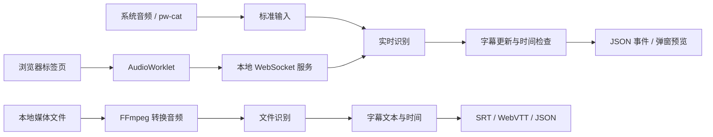

# 架构设计

Substream 分别处理实时字幕和文件字幕。实时识别需要持续接收音频并及时更新文本；文件识别可以读取完整音频，更重视识别准确率和字幕时间。两者使用不同的识别接口，共用字幕数据和导出功能。

## 技术选择

| 技术 | 选择原因 |
| --- | --- |
| Rust | 用统一的数据类型组织音频、字幕和会话状态，便于接入本地识别库，并明确管理模型、连接和子进程的生命周期。 |
| Tokio 与 Axum | 处理 WebSocket 连接、超时和取消。同步推理在独立工作线程中运行，避免阻塞网络通信。 |
| sherpa-onnx | 提供连续音频的增量识别接口和 Rust 接口。当前使用 CPU 上的流式 Transducer 模型，支持的语言由模型决定。 |
| whisper.cpp CLI | 用于完整文件识别，提供段落文本和时间。进程接口便于独立安装和替换引擎，每次任务都需要重新加载模型。 |
| FFmpeg | 统一解码常见媒体格式，将音轨转换为识别所需的采样率和声道数。 |
| TypeScript 与 Chromium 扩展 API | 通过 `tabCapture` 获取用户选择的标签页音频，用后台文档维持捕获，以 `AudioWorklet` 处理音频；类型检查帮助约束各部分的消息格式。 |

接口用法可查阅 [sherpa-onnx Rust 文档](https://k2-fsa.github.io/sherpa/onnx/rust-api/index.html)、[whisper.cpp CLI](https://github.com/ggml-org/whisper.cpp/tree/master/examples/cli) 和 [Chrome 音频捕获说明](https://developer.chrome.com/docs/extensions/how-to/web-platform/screen-capture)。

## 数据流与模块职责

`core` 定义音频、字幕和识别接口，负责时间检查、文本更新及导出。它不依赖网络、设备或具体识别引擎。`backends` 接入识别库和外部程序；`protocol` 定义客户端消息；应用层负责配置、认证和任务调度。

实时识别器在工作线程中创建、调用和销毁。网络服务通过队列交换音频与字幕。队列限制容量和等待时间，处理不及时便报告错误并结束连接，避免字幕持续落后于声音。目前一个服务只运行一个实时识别会话，以限制模型的内存占用。

正常停止时，服务处理完已接收的音频，再输出末尾字幕和完成消息。意外断开会取消任务。已进入本地识别库的计算仍需等待调用返回，不能立即强制中断。

## 字幕内容与时间

音频统一为 16 kHz 单声道，时间按累计采样数计算。静音也计入时间；模型结束识别所需的补充静音不延长字幕时间。

一段字幕可以多次更新。`stable_text` 表示近期较少变化的前缀，供界面区分显示；后续结果仍可修正它。客户端按段落编号替换旧文本，收到 `is_final: true` 后再保存最终结果。定稿后的段落不再修改。

文件字幕保留模型给出的段落时间。换行按显示宽度处理，避免拆开组合字符和表情。按词调整字幕时间需要额外的语音对齐结果，当前只进行换行和时间检查。

## 浏览器与桌面显示

扩展先等待本地服务加载模型，再申请标签页音频，避免短期有效的捕获凭据在加载期间过期。后台文档持有音频流，因此关闭弹窗后仍能继续捕获。音频在浏览器中转换为 16 kHz，同时通过独立音频输出保留原声音。[tabCapture 接口说明](https://developer.chrome.com/docs/extensions/reference/api/tabCapture)

标签页捕获的时间从开始采集时算起。视频暂停、跳转或变速后，它不再对应视频时间，因此整段视频字幕应从完整媒体文件生成。扩展目前只保存最新状态和字幕预览。

桌面悬浮字幕尚未实现，显示层需要按桌面环境接入。`gtk4-layer-shell` 支持 KDE 和部分使用 wlroots 的桌面；GNOME Wayland 需要评估 Shell 扩展或独立字幕窗口。接入时应在目标桌面检查全屏、多屏、缩放和鼠标穿透。[桌面兼容说明](https://github.com/wmww/gtk4-layer-shell#supported-desktops)

## 后续扩展

- 先选定目标语言的模型和代表性音频，测量准确率、字幕延迟与资源占用，再决定是否增加 GPU 或更换引擎。
- 系统音频可增加直接调用 PipeWire 的采集模块，处理设备切换和断流。字幕界面订阅字幕事件，不参与音频采集或推理。
- 网页整段字幕需要独立的媒体获取模块，将可访问的媒体保存为文件，再交给文件识别接口。网站规则与字幕核心分开维护。
- 翻译和总结读取已定稿的 `Transcript`，保留原文及来源时间。需要任务恢复和历史查询时，再增加持久化存储。

新增模块应对应实际功能或独立依赖，不为尚未实现的能力预先建立空接口。
