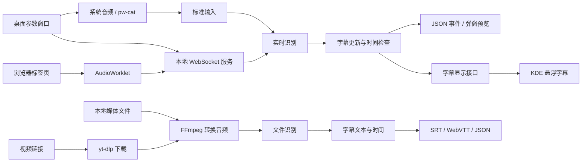

# 架构设计

Substream 分别处理实时字幕和文件字幕。实时识别需要持续接收音频并及时更新文本；文件识别可以读取完整音频，更重视识别准确率和字幕时间。两者使用不同的识别接口，共用字幕数据和导出功能。

## 技术选择

| 技术 | 选择原因 |
| --- | --- |
| Rust | 用统一的数据类型组织音频、字幕和会话状态，便于接入本地识别库，并明确管理模型、连接和子进程的生命周期。 |
| Tokio 与 Axum | 处理 WebSocket 连接、超时和取消。同步推理在独立工作线程中运行，避免阻塞网络通信。 |
| sherpa-onnx | 提供连续音频的增量识别接口和 Rust 接口。当前使用 CPU 上的流式 Transducer 模型，支持的语言由模型决定。 |
| whisper.cpp CLI | 用于完整文件识别，提供段落文本和时间。进程接口便于独立安装和替换引擎，每次任务都需要重新加载模型。 |
| FFmpeg | 统一解码常见媒体格式，将音轨转换为识别所需的采样率和声道数。 |
| yt-dlp | 处理网站链接、媒体下载和浏览器 Cookie。通过独立进程调用，网站适配可随 yt-dlp 更新，不影响字幕识别接口。 |
| TypeScript 与 Chromium 扩展 API | 通过 `tabCapture` 获取用户选择的标签页音频，用后台文档维持捕获，以 `AudioWorklet` 处理音频；类型检查帮助约束各部分的消息格式。 |
| Qt Widgets、Qt Quick 与 LayerShellQt | Widgets 提供参数表单和文件选择，Quick 负责字幕排版和缩放，LayerShellQt 将字幕放入 KDE Wayland 悬浮层。界面通过异步子进程和 JSON 连接识别服务，模型加载不会阻塞窗口。 |

接口用法可查阅 [sherpa-onnx Rust 文档](https://k2-fsa.github.io/sherpa/onnx/rust-api/index.html)、[whisper.cpp CLI](https://github.com/ggml-org/whisper.cpp/tree/master/examples/cli) 和 [Chrome 音频捕获说明](https://developer.chrome.com/docs/extensions/how-to/web-platform/screen-capture)。

## 数据流与模块职责

`core` 定义音频、字幕和识别接口，负责时间检查、文本更新及导出。它不依赖网络、设备或具体识别引擎。`backends` 接入识别库和外部程序；`protocol` 定义客户端消息；应用层负责配置、认证和任务调度。

实时识别器在工作线程中创建、调用和销毁。网络服务通过队列交换音频与字幕。队列限制容量和等待时间，处理不及时便报告错误并结束连接，避免字幕持续落后于声音。目前一个服务只运行一个实时识别会话，以限制模型的内存占用。

正常停止时，服务处理完已接收的音频，再输出末尾字幕和完成消息。意外断开会取消任务。已进入本地识别库的计算仍需等待调用返回，不能立即强制中断。

## 字幕内容与时间

音频统一为 16 kHz 单声道，时间按累计采样数计算。静音也计入时间；模型结束识别所需的补充静音不延长字幕时间。

一段字幕可以多次更新。`stable_text` 表示近期较少变化的前缀，供界面区分显示；后续结果仍可修正它。客户端按段落编号替换旧文本，收到 `is_final: true` 后再保存最终结果。定稿后的段落不再修改。

文件字幕保留模型给出的段落时间。换行按显示宽度处理，避免拆开组合字符和表情。按词调整字幕时间需要额外的语音对齐结果，当前只进行换行和时间检查。

## 完整视频任务

`run_video` 先通过 yt-dlp 检查字幕。存在匹配字幕时，下载视频和字幕，统一转换为 SRT 后导入时间与文本；否则转换完整音轨并调用 whisper.cpp。两条路径共用 SRT、WebVTT 和 JSON 导出。桌面页面通过命令行运行任务，HTTP 服务直接调用同一流程，识别器不需要了解网站或浏览器。

字幕解析使用 `subtp`，HTML 实体转换使用 `html-escape`。重叠字幕按开始和结束时间划分区间，保留同一时刻显示的文字，并去除重复行。内部 `Transcript` 仍使用不重叠的段落，不需要调整识别器与导出接口。

模型、输出目录、程序路径和 Cookie 来源由本地配置决定。客户端只提交 HTTP 或 HTTPS 链接，不能传入下载参数或程序路径。yt-dlp 不读取用户的默认配置或插件，参数直接传给进程，不经过 Shell。每个任务使用私有目录，避免覆盖其他结果；失败或取消会删除该目录。子进程使用独立进程组，取消和超时会同时结束下载器及其启动的媒体处理进程。

服务同一时间处理一个视频任务，与实时识别分别限制并发。视频请求立即返回任务编号，客户端通过 HTTP 查询状态和结果，不需要保持长连接。最近 32 个任务状态保存在内存中，重启后清空；完成的文件保留在磁盘。HTTP 接口沿用配对令牌和来源白名单，详见 [视频任务协议](protocol.md#视频任务)。

`VideoDocument` 包含来源信息和带时间的 `Transcript`。后续总结功能可以直接消费这份文档，将摘要引用关联到视频片段，无需重复下载或识别。扩展的 `video.ts` 提供任务与文档接口，当前未实现总结模型调用和一键下载界面。

## 浏览器与桌面显示

扩展先等待本地服务加载模型，再申请标签页音频，避免短期有效的捕获凭据在加载期间过期。后台文档持有音频流，因此关闭弹窗后仍能继续捕获。音频在浏览器中转换为 16 kHz，同时通过独立音频输出保留原声音。[tabCapture 接口说明](https://developer.chrome.com/docs/extensions/reference/api/tabCapture)

标签页捕获的时间从开始采集时算起。视频暂停、跳转或变速后，它不再对应视频时间，因此整段视频字幕应从完整媒体文件生成。扩展目前只保存最新状态和字幕预览。

KDE 显示端通过 LayerShellQt 创建悬浮窗口，设置鼠标穿透、无键盘焦点和不占用桌面布局。窗口按所选屏幕的逻辑尺寸排版，Qt 处理缩放。[LayerShellQt](https://github.com/KDE/layer-shell-qt)、[Qt 窗口属性](https://doc.qt.io/qt-6/qt.html#WindowType-enum)。

显示程序有两种输入：`stream` 命令的逐行 JSON，以及本地服务的 `/v1/display` 订阅。订阅使用相同的令牌认证，只返回最新字幕状态，不接收音频，也不占用识别会话。服务合并尚未发送的更新，显示程序关闭或读取缓慢不会阻塞推理。

桌面程序的 `MainWindow` 编辑参数并显示状态，`AudioDevices` 从 `pw-dump` 读取输入、输出设备，`SessionController` 管理采集和识别进程。模型返回就绪消息后才启动采集。音频使用设备的 `object.serial` 定位，设备断开时停止，不切换到其他输入。

系统音频由 `pw-cat` 转为 16 kHz 单声道 PCM，经有界缓冲送入 `substream stream`。待发送音频超过 250 毫秒时停止并报告积压。正常停止先结束采集，再关闭识别进程的标准输入，让它输出末尾字幕。设置保存在 Qt 的用户配置目录，令牌单独保存为私有文件。

浏览器模式启动本地服务并订阅显示状态。模型在浏览器开始会话时加载，界面据此显示加载状态、标签页名称和已接收音频时长。停止服务会取消浏览器会话；需要保留末尾字幕时，应先在扩展中停止捕获。

`CaptionModel` 处理段落替换和显示时长，`EventSource` 接收消息，`KdeWindow` 负责 KDE 窗口设置，QML 负责排版。桌面无关的消息类型定义在 `substream-protocol::display` 中。GNOME Shell 扩展可以直接订阅该接口，不需要使用 Qt 或修改识别核心；当前尚未提供 GNOME 显示端。

## 其他扩展接口

`RecognizerFactory` 在每次会话中创建识别器，便于嵌入本地服务和替换推理引擎。`StreamingRecognizer` 接收连续音频，`BatchRecognizer` 接收完整音频文件，两者返回统一的字幕数据。系统音频通过标准输入接入，视频下载完成后进入文件识别流程。

已定稿的 `Transcript` 包含文本和来源时间，可供翻译、总结或历史记录使用。这些功能不需要接触音频采集回调。
