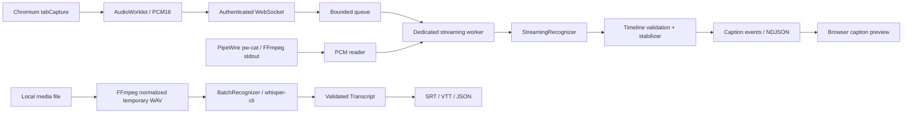

# 需求与架构决策

基于引用对话中的用户需求：低延迟、多语言、系统悬浮字幕；浏览器视频的完整字幕；只处理无保护限制的内容；AI 总结后续扩展。本文区分需求、采用的设计和本次实现边界，不把此前对话中的性能数字当作已验证结论。

## 两种任务的优化目标

| 维度 | 实时字幕 | 完整视频字幕 |
| --- | --- | --- |
| 输入 | 正在发生的系统/标签页音频 | 可读取的完整媒体资源 |
| 核心指标 | 首个 partial、稳定字幕、P95/P99 延迟 | 识别质量、时间轴质量、RTF、总耗时 |
| 时间基准 | 会话内采样位置 | 原始媒体时间轴 |
| 排队策略 | 容量与音频年龄均有限制，超载显式失败 | 背压、持久化任务、取消/恢复 |
| 识别方式 | 增量 streaming recognizer | 完整上下文或分段 batch recognizer |

“绝对高性能”不能直接成为验收条件。必须绑定硬件、语言、模型、精度和工作负载；例如减小模型能降低延迟，但可能明显损害日语/噪声场景的识别效果。

## 对参考方案的取舍

1. **采用 Rust 组织管线，不把语言选择视为性能证明。** 领域层不依赖 SDK；FFI 留在适配器。Python/CTranslate2 也可成为未来离线进程后端，但先用同等模型、精度和硬件测量后再选择，避免先引入多套大运行时。
2. **保留 streaming / batch 两种接口。** Whisper 的流式示例属于窗口重复推理，不能因其名称包含 streaming 就保证低延迟。本阶段实时使用 sherpa streaming transducer，离线使用 whisper.cpp CLI；不在每个实时块上重启 CLI。[Whisper 官方流式示例](https://github.com/ggml-org/whisper.cpp/tree/master/examples/stream)
3. **不假定一个 sherpa 模型覆盖全部语言。** 语言清单属于模型配置。现阶段支持选择模型，没有自动语言切换、模型热加载或翻译。日→中需求应拆成日语识别与中文翻译，原文和译文都保留。[sherpa 官方 Rust 接口](https://k2-fsa.github.io/sherpa/onnx/rust-api/index.html)
4. **修正 GNOME 悬浮层方案。** `gtk4-layer-shell` 明确不支持 GNOME Wayland；KDE/wlroots 等可作为它的目标。GNOME 应单独验证 Shell 扩展或普通字幕窗口。全屏、输入穿透、多屏与缩放均是桌面能力，不能由通用 GTK 窗口保证。本阶段不发布未经验证的全局 overlay。[上游桌面兼容说明](https://github.com/wmww/gtk4-layer-shell#supported-desktops)
5. **浏览器捕获与媒体下载分开。** `tabCapture` 可以捕获正在播放的标签页，在 MV3 中由 offscreen document 持有流；需要用户主动触发。它不能提前拿到尚未播放的内容，也不能恢复已经播放的内容。`captureStream()`、页面 URL 和 `blob:` 不能成为通用整段下载接口。[Chrome 官方流程](https://developer.chrome.com/docs/extensions/how-to/web-platform/screen-capture) 捕获 ID 数秒后过期，因此先等待 daemon/model ready，再申请 ID 并立即消费。[tabCapture API](https://developer.chrome.com/docs/extensions/reference/api/tabCapture)
6. **GPU 优先级不等于可抢占正在执行的推理。** 本阶段单路实时准入、固定 CPU 线程数、实时/离线独立入口。没有“batch 随时让出 GPU”的保证。后续需要小批次调度、实时任务的显存预留或设备隔离；跨进程 CPU/内存/GPU 争用仍须测量。
7. **稳定文本是显示提示。** 连续两次相同的 grapheme 前缀显示为稳定；新的识别结果可以修正它，final 具有最终权威。同一段 revision 递增，final 后不可修改。这避免把一次错误识别永久冻结，也不会切断 CJK、组合字符或 emoji。
8. **不以 VAD 静音裁剪破坏时钟。** 初版使用 streaming recognizer 的 endpointing，不额外删除静音。模型需要的结束 padding 不推进对外时间。以后 VAD 必须保留 pre-roll、hangover 和媒体偏移映射；静音本身也是端点判断的证据。
9. **字幕排版不伪造对齐。** Whisper 段落时间先保留；只有真实词级/字符级对齐可用于进一步控制两行、CPS 和语义边界。模型 BPE token 不是自然语言的词。当前导出只校验时间与换行。[whisper.cpp JSON 输出实现](https://github.com/ggml-org/whisper.cpp/blob/master/examples/cli/cli.cpp)
10. **暂不引入 SQLite、模型仓库和多进程调度系统。** 首版边界是可测试的管线与协议。离线任务恢复、多任务历史出现后再增加存储；AI 消费定稿 Transcript，即可避免与音频采集耦合。

## 本阶段数据流

领域层只使用 owned PCM 和普通 Rust 数据类型。当前音频转换有受控分配与拷贝，没有宣称 zero-copy。`StreamingRecognizer` 不要求 `Send`：FFI 对象在专属 worker 创建和销毁。默认构建没有 native ASR 依赖；`sherpa` feature 增加上游 CPU 库。

浏览器的 MessagePort 最多允许四个未归还的音频块；WebSocket 发送缓存最多八个标准帧；daemon 最多八个待处理块，入队后年龄不得超过 250 ms。任何一层超载都报告错误并终止当前时间轴。选择显式失败，是为了在第一阶段保证数据缺失可见；后续恢复协议可以丢弃旧块并带 discontinuity 标记重建上下文。

daemon 只允许一个活动识别器、最多四个连接，避免模型内存因任意连接数量扩张。推理同步运行于 blocking worker，不能放到 Tokio reactor。正常停止关闭输入并排空队列，flush 后发送 final 与 finished；连接丢失取消工作。已经进入 native decode 的计算无法被 Rust future 强制中止。

## 媒体时间轴与来源

实时 `start_sample` 从零开始，表示“采集会话已经收到多少音频”，不是 `video.currentTime`。暂停、seek、倍速、切换页面均可能使它偏离视频时间；本阶段不把该时钟导出为视频同步字幕。

后续浏览器整段生成需要独立 `MediaResolver`：把来源页面转换成用户可访问的媒体或本地文件，并记录媒体时基、长度、音轨、到期时间以及必要的有限授权。YouTube/Bilibili 的 DASH、签名 URL、分轨、cookie 和接口变化留在 resolver；核心不内置网站规则。服务当前不接受 URL，避免半成品接口暗中获取任意资源。保护内容和 DRM 绕过不进入 resolver 的能力范围。

## 下一步迭代与验收

| 顺序 | 交付 | 验收条件 |
| --- | --- | --- |
| 1 | 固定中/日/英模型及音频集 | 发布模型与数据哈希，测 WER/CER、端点延迟和 P99；明确硬件与线程数 |
| 2 | 原生 PipeWire source + 预分配 SPSC | 回调无推理、无锁、无分配；设备切换和 graph rate 变化可恢复；断流有计数 |
| 3 | 桌面显示与事件订阅 | KDE/layer-shell 和 GNOME 方案分别验证全屏、多屏、缩放、输入穿透；渲染器崩溃不影响推理 |
| 4 | 媒体 resolver + 离线任务 API | 用户主动提交；本地/直接媒体首先可用；可取消、有限并发、完整时间轴与原子导出 |
| 5 | 大文件分段、对齐与 GPU 实测 | 模型常驻、时间重叠去重、有限内存/磁盘、无人工插值的字幕时间、实时任务不被离线拖慢 |
| 6 | 原文/翻译/AI 插件 | 定稿 Transcript 可独立重放；翻译不会覆写原文；总结能回指来源时间 |

无需现在为每个未来能力创建一个空 crate。出现第二个实现、独立依赖或不同生命周期时再拆边界。
